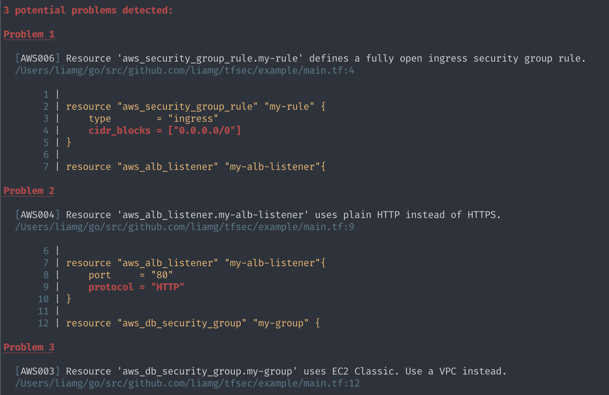

# tfsec

[](https://travis-ci.org/liamg/tfsec)
[](https://goreportcard.com/report/github.com/liamg/tfsec)
[](https://www.codetriage.com/liamg/tfsec)
[](https://github.com/liamg/tfsec/releases)
[](https://github.com/liamg/tfsec/releases)

tfsec uses static analysis of your terraform templates to spot potential security issues. Now with terraform v0.12+ support.



## Installation

Grab the binary for your system from the [releases page](https://github.com/liamg/tfsec/releases).

Alternatively, install with Go:

```bash
go get -u github.com/liamg/tfsec
```

## Usage

tfsec will recursively scan the specified directory. If no directory is specified, the current working directory will be used.

The exit status will be non zero if problems are found, otherwise the exit status will be zero.

```bash
tfsec .
```

## Ignoring Warnings

You may wish to ignore some warnings. If you'd like to do so, you can simply add a comment containing `tfsec:ignore` to the offending line in your templates. If the problem refers to a block of code, such as a multiline string, you can add the comment on the line above the block, by itself.

For example, to ignore any warnings about an open security group rule:

```hcl
resource "aws_security_group_rule" "my-rule" {
    type = "ingress"
    cidr_blocks = ["0.0.0.0/0"] #tfsec:ignore
}
```

...or...

```hcl
resource "aws_security_group_rule" "my-rule" {
    type = "ingress"
    #tfsec:ignore
    cidr_blocks = ["0.0.0.0/0"] 
}
```

If you're not sure which line to add the comment on, just check the tfsec output for the line number of the discovered problem.

## Included Checks

Currently, checks are mostly limited to AWS/Azure resources, though support for more common providers will be added in the coming weeks.

| Code    | Provider | Description |
|---------|----------|-------------|
| GEN001  | *        | Potentially sensitive data stored in "default" value of variable.
| GEN002  | *        | Potentially sensitive data stored in local value.
| GEN003  | *        | Potentially sensitive data stored in block attribute.
| AWS001  | aws      | S3 Bucket has an ACL defined which allows public access.
| AWS002  | aws      | S3 Bucket does not have logging enabled.
| AWS003  | aws      | AWS Classic resource usage.
| AWS004  | aws      | Use of plain HTTP.
| AWS005  | aws      | Load balancer is exposed to the internet.
| AWS006  | aws      | An ingress security group rule allows traffic from `/0`.
| AWS007  | aws      | An egress security group rule allows traffic to `/0`.
| AWS008  | aws      | An inline ingress security group rule allows traffic from `/0`.
| AWS009  | aws      | An inline egress security group rule allows traffic to `/0`.
| AWS010  | aws      | An outdated SSL policy is in use by a load balancer.
| AWS011  | aws      | A resource is marked as publicly accessible.
| AWS012  | aws      | A resource has a public IP address.
| AWS013  | aws      | Task definition defines sensitive environment variable(s).
| AWS014  | aws      | Launch configuration with unencrypted block device.
| AZU001  | azurerm  | An inbound network security rule allows traffic from `/0`.
| AZU002  | azurerm  | An outbound network security rule allows traffic to `/0`.
| AZU003  | azurerm  | Unencrypted managed disk.
| AZU004  | azurerm  | Unencrypted data lake store.
| AZU005  | azurerm  | Password authentication in use instead of SSH keys.

## Support for older terraform versions

If you need to support versions of terraform which use HCL v1 (terraform <0.12), you can use `v0.1.3` of tfsec, though support is very limited and has fewer checks.
