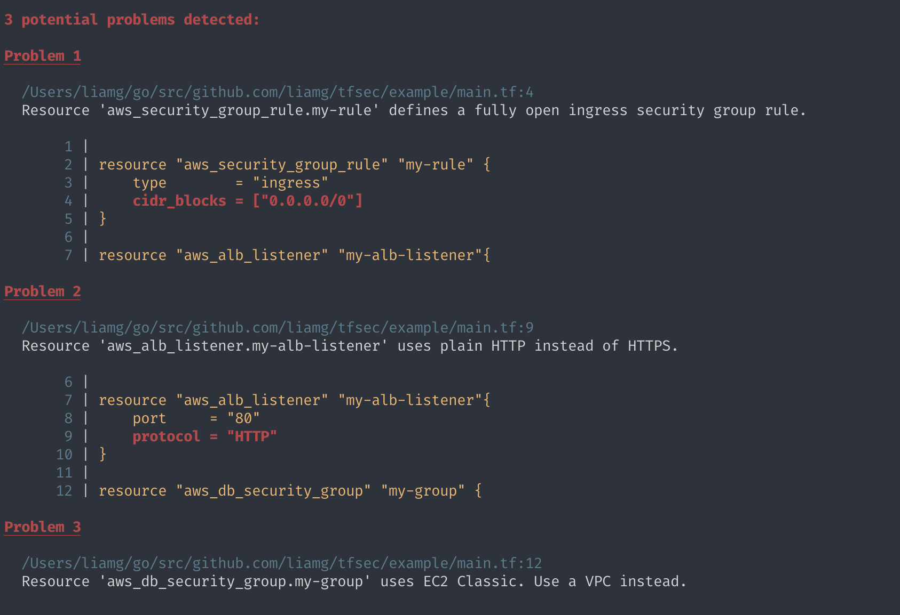
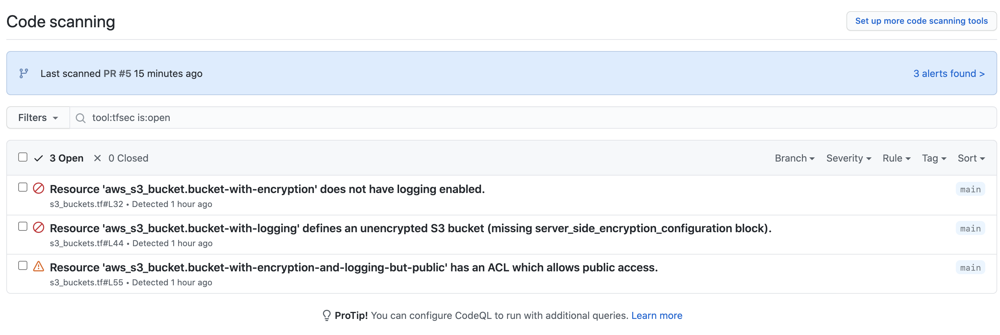
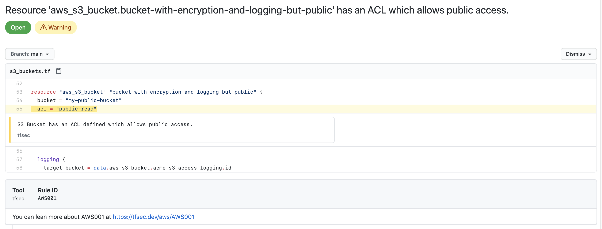

<p align="center">
  
</p>

[](https://goreportcard.com/report/github.com/aquasecurity/tfsec)
[](https://slack.aquasec.com/)
[](https://hub.docker.com/r/tfsec/tfsec)
[](https://formulae.brew.sh/formula/tfsec)
[](https://chocolatey.org/packages/tfsec)
[](https://aur.archlinux.org/packages/tfsec-bin)
[](https://marketplace.visualstudio.com/items?itemName=tfsec.tfsec)

## 📣 tfsec to Trivy Migration

As part of our goal to provide a comprehensive open source security solution for all, we have been consolidating all of our scanning-related efforts in one place, and that is [Trivy](https://github.com/aquasecurity/trivy). 

Over the past year, tfsec has laid the foundations to Trivy's IaC & misconfigurations scanning capabilities, including Terraform scanning, which has been natively supported in Trivy for a long time now.

Going forward we want to encourage the tfsec community to transition over to Trivy. Moving to Trivy gives you the same excellent Terraform scanning engine, with some extra benefits:

1. Access to more languages and features in the same tool.
2. Access to more integrations with tools and services through the rich ecosystem around Trivy.
3. Commercially supported by Aqua as well as by a the passionate Trivy community.
tfsec will continue to remain available for the time being, although our engineering attention will be directed at Trivy going forward.

## tfsec to Trivy migration guide

For further information on how Trivy compares to tfsec and moving from tfsec to Trivy, do have a look at the [migration guide.](https://github.com/aquasecurity/tfsec/blob/master/tfsec-to-trivy-migration-guide.md)

## Overview
tfsec uses static analysis of your terraform code to spot potential misconfigurations.

### Features

- :cloud: Checks for misconfigurations across all major (and some minor) cloud providers
- :no_entry: Hundreds of built-in rules
- :nesting_dolls: Scans modules (local and remote)
- :heavy_plus_sign: Evaluates HCL expressions as well as literal values
- :arrow_right_hook: Evaluates Terraform functions e.g. `concat()`
- :link: Evaluates relationships between Terraform resources
- :toolbox: Compatible with the Terraform CDK
- :no_good: Applies (and embellishes) user-defined Rego policies
- :page_with_curl: Supports multiple output formats: lovely (default), JSON, SARIF, CSV, CheckStyle, JUnit, text, Gif.
- :hammer_and_wrench: Configurable (via CLI flags and/or config file)
- :zap: Very fast, capable of quickly scanning huge repositories
- :electric_plug: Plugins for popular IDEs available ([JetBrains](https://plugins.jetbrains.com/plugin/18687-tfsec-findings-explorer), [VSCode](https://marketplace.visualstudio.com/items?itemName=tfsec.tfsec) and [Vim](https://github.com/aquasecurity/vim-tfsec))
- :house_with_garden: Community-driven - come and chat with us [on Slack](https://slack.aquasec.com/)!

## Recommended by Thoughtworks

Rated _Adopt_ by the [Thoughtworks Tech Radar](https://www.thoughtworks.com/en-gb/radar/tools/tfsec):

> For our projects using Terraform, tfsec has quickly become a default static analysis tool to detect potential security risks. It's easy to integrate into a CI pipeline and has a growing library of checks against all of the major cloud providers and platforms like Kubernetes. Given its ease of use, we believe tfsec could be a good addition to any Terraform project.

## Example Output



## Installation

Install with [brew/linuxbrew](https://brew.sh)

```bash
brew install tfsec
```

Install with [Chocolatey](https://chocolatey.org/)

```cmd
choco install tfsec
```

Install with [Scoop](https://scoop.sh/)

```cmd
scoop install tfsec
```
Bash script (Linux):

```console
curl -s https://raw.githubusercontent.com/aquasecurity/tfsec/master/scripts/install_linux.sh | bash
```

You can also grab the binary for your system from the [releases page](https://github.com/aquasecurity/tfsec/releases).

Alternatively, install with Go:

```bash
go install github.com/aquasecurity/tfsec/cmd/tfsec@latest
```

Please note that using `go install` will install directly from the `master` branch and version numbers will not be reported via `tfsec --version`.

### Signing

The binaries on the [releases page](https://github.com/aquasecurity/tfsec/releases) are signed with the tfsec signing key `D66B222A3EA4C25D5D1A097FC34ACEFB46EC39CE`

Form more information check the [signing page](SIGNING.md) for instructions on verification.

## Usage

tfsec will scan the specified directory. If no directory is specified, the current working directory will be used.

The exit status will be non-zero if tfsec finds problems, otherwise the exit status will be zero.

```bash
tfsec .
```

## Use with Docker

As an alternative to installing and running tfsec on your system, you may run tfsec in a Docker container.

There are a number of Docker options available

| Image Name | Base | Comment |
|------------|------|---------|
|[aquasec/tfsec](https://hub.docker.com/r/aquasec/tfsec)|alpine|Normal tfsec image|
|[aquasec/tfsec-alpine](https://hub.docker.com/r/aquasec/tfsec-alpine)|alpine|Exactly the same as aquasec/tfsec, but for those whole like to be explicit|
|[aquasec/tfsec-ci](https://hub.docker.com/r/aquasec/tfsec-ci)|alpine|tfsec with no entrypoint - useful for CI builds where you want to override the command|
|[aquasec/tfsec-scratch](https://hub.docker.com/r/aquasec/tfsec-scratch)|scratch|An image built on scratch - nothing frilly, just runs tfsec|

To run:

```bash
docker run --rm -it -v "$(pwd):/src" aquasec/tfsec /src
```

## Use with Visual Studio Code

A Visual Studio Code extension is being developed to integrate with tfsec results. More information can be found on the [tfsec Marketplace page](https://marketplace.visualstudio.com/items?itemName=tfsec.tfsec)

## Use as GitHub Action

If you want to run tfsec on your repository as a GitHub Action, you can use [https://github.com/aquasecurity/tfsec-pr-commenter-action](https://github.com/aquasecurity/tfsec-pr-commenter-action).

## Use as an Azure DevOps Pipelines Task

You can now install the [official tfsec task](https://marketplace.visualstudio.com/items?itemName=AquaSecurityOfficial.tfsec-official). Please raise any issues/feature requests on the [task repository](https://github.com/aquasecurity/tfsec-azure-pipelines-task).

## Ignoring Warnings

You may wish to ignore some warnings. If you'd like to do so, you can
simply add a comment containing `tfsec:ignore:<rule>` to the offending
line in your templates. Alternatively, you can add the comment to the line above the block containing the issue, or to the module block to ignore all occurrences of an issue inside the module.

For example, to ignore an open security group rule:

```terraform
resource "aws_security_group_rule" "my-rule" {
    type = "ingress"
    cidr_blocks = ["0.0.0.0/0"] #tfsec:ignore:aws-vpc-no-public-ingress-sgr
}
```

...or...

```terraform
resource "aws_security_group_rule" "my-rule" {
    type = "ingress"
    #tfsec:ignore:aws-vpc-no-public-ingress-sgr
    cidr_blocks = ["0.0.0.0/0"]
}
```

If you're not sure which line to add the comment on, just check the
tfsec output for the line number of the discovered problem.

You can ignore multiple rules by concatenating the rules on a single line:

```terraform
#tfsec:ignore:aws-s3-enable-bucket-encryption tfsec:ignore:aws-s3-enable-bucket-logging
resource "aws_s3_bucket" "my-bucket" {
  bucket = "foobar"
  acl    = "private"
}
```

### Expiration Date
You can set expiration date for `ignore` with `yyyy-mm-dd` format. This is a useful feature when you want to ensure ignored issue won't be forgotten and should be revisited in the future.
```
#tfsec:ignore:aws-s3-enable-bucket-encryption:exp:2025-01-02
```
Ignore like this will be active only till `2025-01-02`, after this date it will be deactivated.

## Disable checks

You may wish to exclude some checks from running. If you'd like to do so, you can
simply add new argument `-e check1,check2,etc` to your cmd command

```bash
tfsec . -e general-secrets-sensitive-in-variable,google-compute-disk-encryption-customer-keys
```

## Including values from .tfvars

You can include values from a tfvars file in the scan,  using, for example: `--tfvars-file terraform.tfvars`.

## Included Checks

tfsec supports many popular cloud and platform providers

| Checks                                                                                  |
|:----------------------------------------------------------------------------------------|
| [AWS Checks](https://aquasecurity.github.io/tfsec/latest/checks/aws/)                   |
| [Azure Checks](https://aquasecurity.github.io/tfsec/latest/checks/azure/)               |
| [GCP Checks](https://aquasecurity.github.io/tfsec/latest/checks/google/)                |
| [CloudStack Checks](https://aquasecurity.github.io/tfsec/latest/checks/cloudstack/)     |
| [DigitalOcean Checks](https://aquasecurity.github.io/tfsec/latest/checks/digitalocean/) |
| [GitHub Checks](https://aquasecurity.github.io/tfsec/latest/checks/github/)             |
| [Kubernetes Checks](https://aquasecurity.github.io/tfsec/latest/checks/kubernetes/)     |
| [OpenStack Checks](https://aquasecurity.github.io/tfsec/latest/checks/openstack/)       |
| [Oracle Checks](https://aquasecurity.github.io/tfsec/latest/checks/oracle/)             |

## Running in CI

tfsec is designed for running in a CI pipeline. You may wish to run tfsec as part of your build without coloured
output. You can do this using `--no-colour` (or `--no-color` for our American friends).

## Output options

You can output tfsec results as JSON, CSV, Checkstyle, Sarif, JUnit or just plain old human-readable format. Use the `--format` flag
to specify your desired format.

## GitHub Security Alerts
If you want to integrate with Github Security alerts and include the output of your tfsec checks you can use the [tfsec-sarif-action](https://github.com/marketplace/actions/run-tfsec-with-sarif-upload) Github action to run the static analysis then upload the results to the security alerts tab.

The alerts generated for [tfsec-example-project](https://github.com/tfsec/tfsec-example-project) look like this.



When you click through the alerts for the branch, you get more information about the actual issue.



For more information about adding security alerts, check [the GitHub documentation](https://docs.github.com/en/code-security/repository-security-advisories/about-github-security-advisories-for-repositories)

## Support for older terraform versions

If you need to support versions of terraform which use HCL v1
(terraform <0.12), you can use `v0.1.3` of tfsec, though support is
very limited and has fewer checks.

## Contributing

We always welcome contributions; big or small, it can be documentation updates, adding new checks or something bigger. Please check the [Contributing Guide](CONTRIBUTING.md) for details on how to help out.

### Some People who have contributed

<a href = "https://github.com/aquasecurity/tfsec/graphs/contributors">
  
</a>

Made with [contributors-img](https://contrib.rocks).

`tfsec` is an [Aqua Security](https://aquasec.com) open source project.
Learn about our open source work and portfolio [here](https://www.aquasec.com/products/open-source-projects/).
Join the community, and talk to us about any matter in [GitHub Discussion](https://github.com/aquasecurity/tfsec/discussions) or [Slack](https://slack.aquasec.com).
