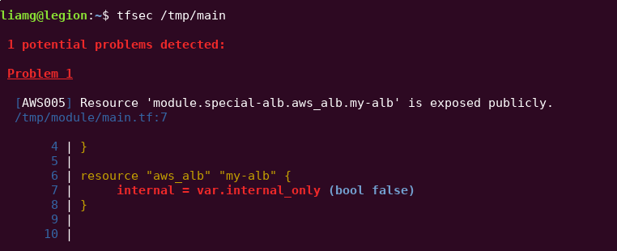

# tfsec

[](https://travis-ci.org/liamg/tfsec)

tfsec uses static analysis of your terraform templates to spot potential security issues. Now with terraform v0.12+ support.



## Installation

Grab the binary for your system from the [releases page](https://github.com/liamg/tfsec/releases).

Alternatively, install with Go:

```bash
go get -u github.com/liamg/tfsec
```

## Usage

tfsec will recursively scan the specified directory. If no directory is specified, the current working directory will be used.

The exit status will be non zero if problems are found, otherwise the exit status will be zero.

```bash
tfsec .
```

## Support for older terraform versions

If you need to support versions of terraform which use HCL v1 (terraform <0.12), you can use `v0.1.3` of tfsec.

### Ignoring Warnings

You may wish to ignore some warnings. If you'd like to do so, you can simply add a comment containing `tfsec:ignore` to the offending line in your templates. If the problem refers to a block of code, such as a multiline string, you can add the comment on the line above the block, by itself.

For example, to ignore any warnings about an open security group rule:

```hcl
resource "aws_security_group_rule" "my-rule" {
    type = "ingress"
    cidr_blocks = ["0.0.0.0/0"] #tfsec:ignore
}
```

If you're not sure which line to add the comment on, just check the tfsec output for the line number of the discovered problem.

## Included Checks

Currently, checks are limited to AWS, though this may change in future.

### Open Security Group Rules

Checks `aws_security_group` and `aws_security_group_rule` for ingress rules allowing traffic from "0.0.0.0/0".

### EC2 Classic Usage

Checks for usage of EC2 Classic resources, including:

- `aws_db_security_group`
- `aws_redshift_security_group`
- `aws_elasticache_security_group`

### Assorted Public Exposure

Checks for public exposure of the following resources:

- `aws_db_instance`
- `aws_dms_replication_instance`
- `aws_rds_cluster_instance`    
- `aws_redshift_cluster`        
- `aws_instance`
- `aws_launch_configuration`
- `aws_s3_bucket`
- `aws_alb`/`aws_lb` 
- `aws_elb`

### Outdated SSL Policies

Checks for insecure SSL policies on `aws_alb_listener`.

### Missing Encryption

Checks for use of plain HTTP on `aws_alb_listener`.
