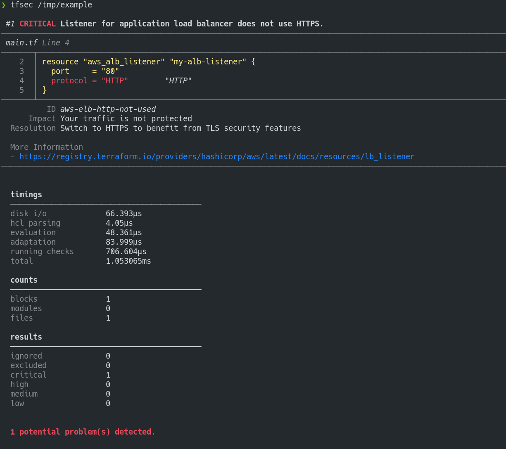

<p align="center">
  
</p>

# tfsec

[](https://travis-ci.com/tfsec/tfsec)
[](https://goreportcard.com/report/github.com/tfsec/tfsec)
[](https://github.com/tfsec/tfsec/releases)
[](https://github.com/tfsec/tfsec/releases)

tfsec uses static analysis of your terraform templates to spot potential
security issues. Now with terraform v0.12+ support.

## Example Output



## Installation

Install with brew/linuxbrew:

```bash
brew tap liamg/tfsec
brew install liamg/tfsec/tfsec
```

Install with Chocolatey:

```cmd
choco install tfsec
```

You can also grab the binary for your system from the [releases page](https://github.com/tfsec/tfsec/releases).

Alternatively, install with Go:

```bash
go get -u github.com/tfsec/tfsec/cmd/tfsec
```

## Usage

tfsec will recursively scan the specified directory. If no directory is
specified, the current working directory will be used.

The exit status will be non zero if problems are found, otherwise the
exit status will be zero.

```bash
tfsec .
```

## Use with Docker

As an alternative to installing and running tfsec on your system, you may
run tfsec in a Docker container.

To run:

```bash
docker run --rm -it -v "$(pwd):/src" liamg/tfsec /src
```

## Use as GitHub Action

If you want to run tfsec on your repository as a GitHub Action, you can use [https://github.com/triat/terraform-security-scan](https://github.com/triat/terraform-security-scan).

## Features

- Checks for sensitive data inclusion across all providers
- Checks for violations of AWS, Azure and GCP security best practice recommendations
- Scans modules (currently only local modules are supported)
- Evaluates expressions as well as literal values
- Evaluates Terraform functions e.g. `concat()`

## Ignoring Warnings

You may wish to ignore some warnings. If you'd like to do so, you can
simply add a comment containing `tfsec:ignore:<RULE>` to the offending
line in your templates. If the problem refers to a block of code, such
as a multiline string, you can add the comment on the line above the
block, by itself.

For example, to ignore an open security group rule:

```hcl
resource "aws_security_group_rule" "my-rule" {
    type = "ingress"
    cidr_blocks = ["0.0.0.0/0"] #tfsec:ignore:AWS006
}
```

...or...

```hcl
resource "aws_security_group_rule" "my-rule" {
    type = "ingress"
    #tfsec:ignore:AWS006
    cidr_blocks = ["0.0.0.0/0"]
}
```

If you're not sure which line to add the comment on, just check the
tfsec output for the line number of the discovered problem.

## Disable checks

You may wish to exclude some checks from running. If you'd like to do so, you can
simply add new argument `-e CHECK1,CHECK2,etc` to your cmd command

```bash
tfsec . -e GEN001,GCP001,GCP002
```

## Including values from .tfvars

You can include values from a tfvars file in the scan,  using, for example: `--tfvars-file terraform.tfvars`.

## Excluding Directories

You can exclude directories from being scanned using the `--exclude-dir [directory]` flag. This can be used multiple times to exclude multiple directories.

## Included Checks

Currently, checks are mostly limited to AWS/Azure/GCP resources, but
there are also checks which are provider agnostic.

| Rule    | Provider | Description |
|---------|----------|-------------|
| GEN001  | *        | Potentially sensitive data stored in "default" value of variable.
| GEN002  | *        | Potentially sensitive data stored in local value.
| GEN003  | *        | Potentially sensitive data stored in block attribute.
| AWS001  | aws      | S3 Bucket has an ACL defined which allows public access.
| AWS002  | aws      | S3 Bucket does not have logging enabled.
| AWS003  | aws      | AWS Classic resource usage.
| AWS004  | aws      | Use of plain HTTP.
| AWS005  | aws      | Load balancer is exposed to the internet.
| AWS006  | aws      | An ingress security group rule allows traffic from `/0`.
| AWS007  | aws      | An egress security group rule allows traffic to `/0`.
| AWS008  | aws      | An inline ingress security group rule allows traffic from `/0`.
| AWS009  | aws      | An inline egress security group rule allows traffic to `/0`.
| AWS010  | aws      | An outdated SSL policy is in use by a load balancer.
| AWS011  | aws      | A resource is marked as publicly accessible.
| AWS012  | aws      | A resource has a public IP address.
| AWS013  | aws      | Task definition defines sensitive environment variable(s).
| AWS014  | aws      | Launch configuration with unencrypted block device.
| AWS015  | aws      | Unencrypted SQS queue.
| AWS016  | aws      | Unencrypted SNS topic.
| AWS017  | aws      | Unencrypted S3 bucket.
| AWS018  | aws      | Missing description for security group/security group rule.
| AWS019  | aws      | A KMS key is not configured to auto-rotate
| AWS020  | aws      | CloudFront distribution allows unencrypted (HTTP) communications.
| AWS021  | aws      | CloudFront distribution uses outdated SSL/TSL protocols.
| AWS022  | aws      | A MSK cluster allows unencrypted data in transit.
| AWS023  | aws      | ECR repository has image scans disabled
| AWS024  | aws      | Kinesis stream is unencrypted
| AWS025  | aws      | API Gateway domain name uses outdated SSL/TLS protocols.
| AWS031  | aws      | Elasticsearch domain isn't encrypted at rest.
| AWS032  | aws      | Elasticsearch domain uses plaintext traffic for node to node communication.
| AWS033  | aws      | Elasticsearch doesn't enforce HTTPS traffic.
| AWS034  | aws      | Elasticsearch domain endpoint is using outdated TLS policy.
| AWS035  | aws      | Unencrypted Elasticache Replication Group.
| AWS036  | aws      | Elasticache Replication Group uses unencrypted traffic.
| AZU001  | azurerm  | An inbound network security rule allows traffic from `/0`.
| AZU002  | azurerm  | An outbound network security rule allows traffic to `/0`.
| AZU003  | azurerm  | Unencrypted managed disk.
| AZU004  | azurerm  | Unencrypted data lake store.
| AZU005  | azurerm  | Password authentication in use instead of SSH keys.
| GCP001  | google   | Unencrypted compute disk.
| GCP002  | google   | Unencrypted storage bucket.
| GCP003  | google   | An inbound firewall rule allows traffic from `/0`.
| GCP004  | google   | An outbound firewall rule allows traffic to `/0`.
| GCP005  | google   | Legacy ABAC permissions are enabled.
| GCP006  | google   | Node metadata value disables metadata concealment.
| GCP007  | google   | Legacy metadata endpoints enabled.
| GCP008  | google   | Legacy client authentication methods utilized.
| GCP009  | google   | Pod security policy enforcement not defined.
| GCP010  | google   | Shielded GKE nodes not enabled.
| GCP011  | google   | IAM granted directly to user.

## Running in CI

tfsec is designed for running in a CI pipeline. For this reason it will
exit with a non-zero exit code if a potential problem is detected.
You may wish to run tfsec as part of your build without coloured
output. You can do this using `--no-colour` (or `--no-color` for our
American friends).

## Output options

You can output tfsec results as JSON, CSV, Checkstyle, JUnit or just plain old human readable format. Use the `--format` flag
to specify your desired format.

## Support for older terraform versions

If you need to support versions of terraform which use HCL v1
(terraform <0.12), you can use `v0.1.3` of tfsec, though support is
very limited and has fewer checks.
