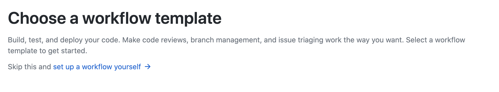

## What is it?

Github security alerts sit on the `Security` tab in your github project and detail any security issues that have been found.

`tfsec` can enrich this information, annotating the exact areas in the code base for a given branch with the details of the failure and the severity.

We have provided an action which can be used in your github repo with very little effort.

## Adding the action

Github Actions make it easy to add functionality; to add an action, go to the `Action` tab to create a new workflow and choose to Set up a workflow yourself.



Paste in the workflow content below (be sure to check you're using the latest version of the tfsec-sarif-action by checking [here](https://github.com/marketplace/actions/run-tfsec-with-sarif-upload))

```yaml
name: tfsec
on:
  push:
    branches:
      - main
  pull_request:
jobs:
  tfsec:
    name: tfsec sarif report
    runs-on: ubuntu-latest

    steps:
      - name: Clone repo
        uses: actions/checkout@main

      - name: tfsec
        uses: tfsec/tfsec-sarif-action@master
        with:
          sarif_file: tfsec.sarif         

      - name: Upload SARIF file
        uses: github/codeql-action/upload-sarif@v1
        with:
          # Path to SARIF file relative to the root of the repository
          sarif_file: tfsec.sarif    
```

## What is this doing?

Basically, this action is starting a new `ubuntu` github action container and checking out the code for either the pull request or the push to [master/main](https://github.com/github/renaming).

Once the code has been checked out, `tfsec` with process everything in the local path and generate a sarif report.

Finally, the sarif report will be uploaded and the `Security` tab updated with the identified checks. 

It will look something like;


## Anything else I should know?

If you have code that is deeper in the github repo, you can use `working_directory` for the action;

```yaml

- name: tfsec
  uses: tfsec/tfsec-sarif-action@v0.0.3
  with:
    working_directory: terraform/relevant
    sarif_file: tfsec.sarif         
    github_token: ${{ secrets.GITHUB_TOKEN }}

```

This will target the checks to all folders under `terraform/relevant`
