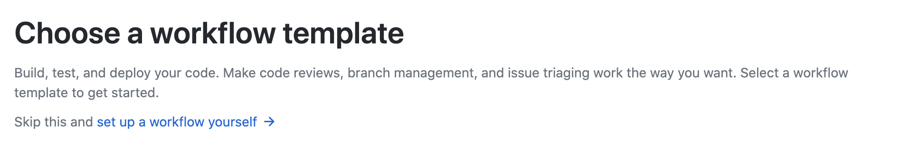
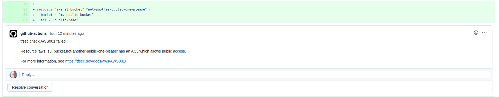

## What is it?

The PR Commenter action will process a Pull request and add comments to any areas of the change which fail the `tfsec` checks.

## Adding the action


To add the action, add tfsec_pr_commenter.yml into the .github/workflows directory in the root of your Github project.



The contents of tfsec_pr_commenter.yml should be;

```yaml

name: tfsec-pr-commenter
on:
  pull_request:
jobs:
  tfsec:
    name: tfsec PR commenter
    runs-on: ubuntu-latest

    steps:
      - name: Clone repo
        uses: actions/checkout@master

      - name: tfsec
        uses: tfsec/tfsec-pr-commenter-action@main
        with:
          github_token: ${{ secrets.GITHUB_TOKEN }}

```


On each pull request and subsequent commit, tfsec will run and add comments to the PR where tfsec has failed.

The comment will only be added once per transgression.

## Example PR Comment

The screenshot below demonstrates the comments that can be expected when using the action


