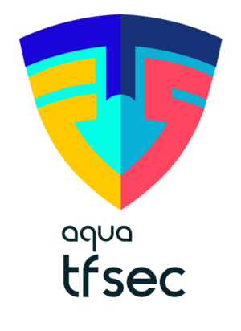

---
hide:
- navigation
- toc
---

 
 

## 📣 tfsec to Trivy Migration

As part of our goal to provide a comprehensive open source security solution for all, we have been consolidating all of our scanning-related efforts in one place, and that is [Trivy](https://github.com/aquasecurity/trivy). 

Over the past year, tfsec has laid the foundations to Trivy's IaC & misconfigurations scanning capabilities, including Terraform scanning, which has been natively supported in Trivy for a long time now.

Going forward we want to encourage the tfsec community to transition over to Trivy. Moving to Trivy gives you the same excellent Terraform scanning engine, with some extra benefits:

1. Access to more languages and features in the same tool.
2. Access to more integrations with tools and services through the rich ecosystem around Trivy.
3. Commercially supported by Aqua as well as by a the passionate Trivy community.
tfsec will continue to remain available for the time being, although our engineering attention will be directed at Trivy going forward.

## tfsec to Trivy migration guide

For further information on how Trivy compares to tfsec and moving from tfsec to Trivy, do have a look at the [migration guide.](https://github.com/aquasecurity/tfsec/blob/master/tfsec-to-trivy-migration-guide.md)

## tfsec

`tfsec` is a static analysis security scanner for your Terraform code.

Designed to run locally and in your CI pipelines, developer-friendly output and fully documented checks mean detection and remediation can take place as quickly and efficiently as possible

`tfsec` takes a developer-first approach to scanning your Terraform templates; using static analysis and deep integration with the official HCL parser it ensures that security issues can be detected before your infrastructure changes take effect.

 
 

<figure style="text-align: center">
  
  <figcaption>Demo: Misconfiguration Detection</figcaption>
</figure>

`tfsec` is an [Aqua Security][aquasec] open source project.  
Learn about our open source work and portfolio [here][oss].  
Contact us about any matter by opening a GitHub Discussion [here][discussions]

[aquasec]: https://aquasec.com
[oss]: https://www.aquasec.com/products/open-source-projects/
[discussions]: https://github.com/aquasecurity/tfsec/discussions
